# RealEstate ERD

Generated from the live MySQL database.

- Tables: 34
- Foreign key relationships: 64

```mermaid
erDiagram
  agencies {
    bigint_unsigned id "PK, NOT_NULL"
    varchar(150) name "NOT_NULL"
    varchar(100) email "UK, NOT_NULL"
    varchar(20) phone
    varchar(255) address
    varchar(100) city
    varchar(100) state_province
    varchar(20) postal_code
    varchar(100) country
    varchar(255) website
    varchar(100) license_number "UK, NOT_NULL"
    int founded_year
    text description
    varchar(500) logo_url
    enum(_active___inactive___suspended_) status
    bigint_unsigned created_by "FK"
    bigint_unsigned updated_by "FK"
    timestamp created_at
    timestamp updated_at
  }

  agents {
    bigint_unsigned id "PK, NOT_NULL"
    bigint_unsigned user_id "FK, UK, NOT_NULL"
    bigint_unsigned agency_id "FK"
    varchar(100) license_number "UK, NOT_NULL"
    varchar(100) specialization
    varchar(20) phone
    text bio
    varchar(500) profile_image_url
    decimal(5_2) commission_rate
    tinyint(1) verified
    timestamp verified_at
    enum(_active___inactive___suspended_) status
    int total_sales
    decimal(12_2) total_revenue
    bigint_unsigned created_by "FK"
    bigint_unsigned updated_by "FK"
    timestamp created_at
    timestamp updated_at
  }

  amenities {
    bigint_unsigned id "PK, NOT_NULL"
    varchar(80) name "UK, NOT_NULL"
    varchar(80) icon
    enum(_indoor___outdoor___security_) category "NOT_NULL"
    timestamp created_at
    timestamp updated_at
  }

  audit_logs {
    bigint_unsigned id "PK, NOT_NULL"
    bigint_unsigned user_id "FK"
    varchar(50) action "NOT_NULL"
    varchar(50) entity "NOT_NULL"
    bigint_unsigned entity_id
    json old_value
    json new_value
    varchar(45) ip_address
    varchar(255) user_agent
    timestamp created_at "NOT_NULL"
  }

  categories {
    bigint_unsigned id "PK, NOT_NULL"
    varchar(50) name "UK, NOT_NULL"
    varchar(70) slug "UK, NOT_NULL"
    timestamp created_at
    timestamp updated_at
  }

  cities {
    bigint_unsigned id "PK, NOT_NULL"
    varchar(100) name "NOT_NULL"
    varchar(100) region
    char(2) country "NOT_NULL"
    timestamp created_at
    timestamp updated_at
  }

  cms_block_versions {
    bigint_unsigned id "PK, NOT_NULL"
    bigint_unsigned block_id "FK, NOT_NULL"
    int version_number "NOT_NULL"
    json content_json "NOT_NULL"
    bigint_unsigned created_by
    timestamp created_at "NOT_NULL"
  }

  cms_blocks {
    bigint_unsigned id "PK, NOT_NULL"
    bigint_unsigned section_id "FK, NOT_NULL"
    varchar(80) key_name "NOT_NULL"
    enum(_text___image___link___json_) type "NOT_NULL"
    json content_json
    json draft_json
    bigint_unsigned updated_by
    timestamp created_at "NOT_NULL"
    timestamp updated_at "NOT_NULL"
  }

  cms_pages {
    bigint_unsigned id "PK, NOT_NULL"
    varchar(120) slug "UK, NOT_NULL"
    varchar(255) title "NOT_NULL"
    varchar(255) meta_title
    text meta_description
    tinyint(1) is_published "NOT_NULL"
    timestamp published_at
    bigint_unsigned created_by
    bigint_unsigned updated_by
    timestamp created_at "NOT_NULL"
    timestamp updated_at "NOT_NULL"
  }

  cms_sections {
    bigint_unsigned id "PK, NOT_NULL"
    bigint_unsigned page_id "FK, NOT_NULL"
    varchar(80) name "NOT_NULL"
    tinyint sort_order "NOT_NULL"
    enum(_hero___features___testimonials___team___faq___stats___mission___contact___footer___generic_) type "NOT_NULL"
    tinyint(1) is_visible "NOT_NULL"
    timestamp created_at "NOT_NULL"
    timestamp updated_at "NOT_NULL"
  }

  favorites {
    int id "PK, NOT_NULL"
    bigint_unsigned buyer_id "FK"
    bigint_unsigned property_id "FK"
  }

  files {
    bigint_unsigned id "PK, NOT_NULL"
    varchar(50) entity
    bigint_unsigned entity_id
    varchar(255) filename "NOT_NULL"
    varchar(255) original_name "NOT_NULL"
    varchar(100) mime_type "NOT_NULL"
    varchar(500) file_path "NOT_NULL"
    bigint file_size "NOT_NULL"
    int width
    int height
    bigint_unsigned uploaded_by "NOT_NULL"
    timestamp created_at "NOT_NULL"
  }

  locations {
    bigint_unsigned id "PK, NOT_NULL"
    bigint_unsigned city_id "FK, NOT_NULL"
    varchar(100) district
    varchar(255) address_line
    varchar(20) postal_code
    decimal(10_7) latitude
    decimal(10_7) longitude
    timestamp created_at
    timestamp updated_at
  }

  message_threads {
    int id "PK, NOT_NULL"
    bigint_unsigned property_id "FK"
    bigint_unsigned buyer_id "FK, NOT_NULL"
    bigint_unsigned seller_id "FK, NOT_NULL"
    timestamp last_message_at
    int buyer_unread_count "NOT_NULL"
    int seller_unread_count "NOT_NULL"
    tinyint(1) is_archived "NOT_NULL"
    timestamp created_at
    timestamp updated_at
  }

  messages {
    int id "PK, NOT_NULL"
    int thread_id "FK"
    bigint_unsigned sender_id "FK"
    bigint_unsigned buyer_id "FK"
    bigint_unsigned seller_id "FK"
    bigint_unsigned property_id "FK"
    text message
    text body "NOT_NULL"
    int attachment_file_id
    tinyint(1) is_edited "NOT_NULL"
    timestamp edited_at
    timestamp read_at
    timestamp created_at
  }

  notifications {
    bigint_unsigned id "PK, NOT_NULL"
    bigint_unsigned user_id "FK, NOT_NULL"
    varchar(50) type "NOT_NULL"
    varchar(150) title "NOT_NULL"
    text message "NOT_NULL"
    varchar(255) link
    tinyint(1) is_read "NOT_NULL"
    timestamp created_at "NOT_NULL"
  }

  offers {
    int id "PK, NOT_NULL"
    bigint_unsigned property_id "FK, NOT_NULL"
    bigint_unsigned buyer_id "FK, NOT_NULL"
    bigint_unsigned seller_id "FK, NOT_NULL"
    decimal(12_2) amount "NOT_NULL"
    char(3) currency "NOT_NULL"
    text message
    enum(_pending___accepted___rejected___countered___expired___withdrawn_) status "NOT_NULL"
    int counter_offer_id "FK"
    timestamp expires_at
    bigint_unsigned created_by "FK"
    bigint_unsigned updated_by "FK"
    timestamp created_at
    timestamp updated_at
  }

  payments {
    int id "PK, NOT_NULL"
    int subscription_id "FK"
    bigint_unsigned user_id "FK, NOT_NULL"
    decimal(8_2) amount "NOT_NULL"
    char(3) currency "NOT_NULL"
    varchar(40) provider "NOT_NULL"
    varchar(120) provider_payment_id
    enum(_pending___paid___failed___refunded_) status "NOT_NULL"
    timestamp paid_at
    timestamp created_at
    timestamp updated_at
  }

  permissions {
    bigint_unsigned id "PK, NOT_NULL"
    varchar(80) name "UK, NOT_NULL"
    varchar(255) description
    varchar(50) resource "NOT_NULL"
  }

  plans {
    int id "PK, NOT_NULL"
    varchar(50) name "UK, NOT_NULL"
    varchar(70) slug "UK, NOT_NULL"
    decimal(8_2) price "NOT_NULL"
    smallint_unsigned duration_days "NOT_NULL"
    smallint_unsigned max_listings "NOT_NULL"
    smallint_unsigned max_featured "NOT_NULL"
    json features
    tinyint(1) is_active "NOT_NULL"
    timestamp created_at
    timestamp updated_at
  }

  properties {
    bigint_unsigned id "PK, NOT_NULL"
    varchar(200) title "NOT_NULL"
    varchar(220) slug "UK, NOT_NULL"
    text description
    decimal(12_2) price "NOT_NULL"
    char(3) currency "NOT_NULL"
    decimal(8_2) area_m2
    tinyint rooms
    tinyint bedrooms
    tinyint bathrooms
    tinyint floor
    tinyint total_floors
    smallint year_built
    bigint_unsigned type_id "FK"
    bigint_unsigned category_id "FK"
    bigint_unsigned location_id "FK"
    varchar(200) location
    varchar(100) type
    enum(_draft___available___reserved___sold___rented___archived_) status "NOT_NULL"
    varchar(500) image_url
    bigint_unsigned seller_id "FK"
    timestamp created_at
    timestamp updated_at
    bigint_unsigned agent_id
    bigint_unsigned agency_id
    int_unsigned views_count "NOT_NULL"
    timestamp featured_until
    timestamp published_at
    bigint_unsigned created_by "FK"
    bigint_unsigned updated_by "FK"
  }

  property_amenities {
    bigint_unsigned id "PK, NOT_NULL"
    bigint_unsigned property_id "FK, NOT_NULL"
    bigint_unsigned amenity_id "FK, NOT_NULL"
    timestamp created_at
  }

  property_images {
    bigint_unsigned id "PK, NOT_NULL"
    bigint_unsigned property_id "FK, NOT_NULL"
    bigint_unsigned file_id
    varchar(500) image_url
    tinyint_unsigned sort_order "NOT_NULL"
    tinyint(1) is_primary "NOT_NULL"
    varchar(150) caption
    timestamp created_at
    timestamp updated_at
  }

  property_types {
    bigint_unsigned id "PK, NOT_NULL"
    varchar(50) name "UK, NOT_NULL"
    varchar(70) slug "UK, NOT_NULL"
    varchar(80) icon
    timestamp created_at
    timestamp updated_at
  }

  refresh_tokens {
    bigint_unsigned id "PK, NOT_NULL"
    bigint_unsigned user_id "FK, NOT_NULL"
    varchar(255) token_hash "UK, NOT_NULL"
    varchar(255) user_agent
    varchar(45) ip_address
    timestamp expires_at "NOT_NULL"
    timestamp revoked_at
    bigint_unsigned replaced_by "FK"
    timestamp created_at "NOT_NULL"
  }

  reviews {
    int id "PK, NOT_NULL"
    bigint_unsigned property_id "FK, NOT_NULL"
    bigint_unsigned user_id "FK, NOT_NULL"
    int transaction_id "FK"
    tinyint_unsigned rating "NOT_NULL"
    varchar(150) title
    text comment "NOT_NULL"
    tinyint(1) is_verified "NOT_NULL"
    tinyint(1) is_hidden "NOT_NULL"
    timestamp created_at
    timestamp updated_at
  }

  role_permissions {
    bigint_unsigned id "PK, NOT_NULL"
    bigint_unsigned role_id "FK, NOT_NULL"
    bigint_unsigned permission_id "FK, NOT_NULL"
  }

  roles {
    bigint_unsigned id "PK, NOT_NULL"
    varchar(50) name "UK, NOT_NULL"
    varchar(255) description
    tinyint(1) is_system "NOT_NULL"
    timestamp created_at "NOT_NULL"
  }

  settings {
    bigint_unsigned id "PK, NOT_NULL"
    varchar(80) key "UK, NOT_NULL"
    text value
    enum(_string___number___boolean___json_) type "NOT_NULL"
    varchar(255) description
    tinyint(1) is_public "NOT_NULL"
    timestamp updated_at "NOT_NULL"
    bigint_unsigned updated_by "FK"
  }

  subscriptions {
    int id "PK, NOT_NULL"
    bigint_unsigned user_id "FK, UK, NOT_NULL"
    int plan_id "FK, NOT_NULL"
    timestamp started_at "NOT_NULL"
    timestamp expires_at
    enum(_active___cancelled___expired_) status "NOT_NULL"
    tinyint(1) auto_renew "NOT_NULL"
    timestamp created_at
    timestamp updated_at
  }

  transactions {
    int id "PK, NOT_NULL"
    int offer_id "FK"
    bigint_unsigned property_id "FK, NOT_NULL"
    bigint_unsigned buyer_id "FK, NOT_NULL"
    bigint_unsigned seller_id "FK, NOT_NULL"
    bigint_unsigned agent_id
    decimal(12_2) amount "NOT_NULL"
    decimal(12_2) commission_amount "NOT_NULL"
    enum(_pending___in_progress___completed___cancelled___refunded_) status "NOT_NULL"
    enum(_cash___bank_transfer___escrow___crypto_) payment_method
    timestamp completed_at
    bigint_unsigned created_by "FK"
    bigint_unsigned updated_by "FK"
    timestamp created_at
    timestamp updated_at
  }

  user_roles {
    bigint_unsigned id "PK, NOT_NULL"
    bigint_unsigned user_id "FK, NOT_NULL"
    bigint_unsigned role_id "FK, NOT_NULL"
    timestamp assigned_at "NOT_NULL"
    bigint_unsigned assigned_by "FK"
  }

  users {
    bigint_unsigned id "PK, NOT_NULL"
    varchar(60) first_name "NOT_NULL"
    varchar(60) last_name "NOT_NULL"
    varchar(100) name "NOT_NULL"
    varchar(150) email "UK, NOT_NULL"
    varchar(255) password "NOT_NULL"
    varchar(255) password_hash "NOT_NULL"
    varchar(30) phone
    bigint_unsigned avatar_file_id
    tinyint(1) is_active "NOT_NULL"
    timestamp email_verified_at
    timestamp last_login_at
    enum(_admin___buyer___seller_) role
    timestamp created_at
    timestamp updated_at "NOT_NULL"
  }

  viewings {
    int id "PK, NOT_NULL"
    bigint_unsigned property_id "FK, NOT_NULL"
    bigint_unsigned buyer_id "FK, NOT_NULL"
    bigint_unsigned seller_id "FK, NOT_NULL"
    datetime scheduled_at "NOT_NULL"
    tinyint_unsigned duration_minutes "NOT_NULL"
    enum(_requested___confirmed___rejected___completed___cancelled_) status "NOT_NULL"
    text notes
    bigint_unsigned cancelled_by "FK"
    varchar(255) cancelled_reason
    bigint_unsigned created_by "FK"
    bigint_unsigned updated_by "FK"
    timestamp created_at
    timestamp updated_at
  }

  agencies ||--o{ agents : "agency_id"
  amenities ||--o{ property_amenities : "amenity_id"
  categories ||--o{ properties : "category_id"
  cities ||--o{ locations : "city_id"
  cms_blocks ||--o{ cms_block_versions : "block_id"
  cms_pages ||--o{ cms_sections : "page_id"
  cms_sections ||--o{ cms_blocks : "section_id"
  locations ||--o{ properties : "location_id"
  message_threads ||--o{ messages : "thread_id"
  offers ||--o{ offers : "counter_offer_id"
  offers ||--o{ transactions : "offer_id"
  permissions ||--o{ role_permissions : "permission_id"
  plans ||--o{ subscriptions : "plan_id"
  properties ||--o{ favorites : "property_id"
  properties ||--o{ message_threads : "property_id"
  properties ||--o{ messages : "property_id"
  properties ||--o{ offers : "property_id"
  properties ||--o{ property_amenities : "property_id"
  properties ||--o{ property_images : "property_id"
  properties ||--o{ reviews : "property_id"
  properties ||--o{ transactions : "property_id"
  properties ||--o{ viewings : "property_id"
  property_types ||--o{ properties : "type_id"
  refresh_tokens ||--o{ refresh_tokens : "replaced_by"
  roles ||--o{ role_permissions : "role_id"
  roles ||--o{ user_roles : "role_id"
  subscriptions ||--o{ payments : "subscription_id"
  transactions ||--o{ reviews : "transaction_id"
  users ||--o{ agencies : "created_by"
  users ||--o{ agencies : "updated_by"
  users ||--o{ agents : "created_by"
  users ||--o{ agents : "updated_by"
  users ||--o{ agents : "user_id"
  users ||--o{ audit_logs : "user_id"
  users ||--o{ favorites : "buyer_id"
  users ||--o{ message_threads : "buyer_id"
  users ||--o{ message_threads : "seller_id"
  users ||--o{ messages : "buyer_id"
  users ||--o{ messages : "seller_id"
  users ||--o{ messages : "sender_id"
  users ||--o{ notifications : "user_id"
  users ||--o{ offers : "buyer_id"
  users ||--o{ offers : "created_by"
  users ||--o{ offers : "seller_id"
  users ||--o{ offers : "updated_by"
  users ||--o{ payments : "user_id"
  users ||--o{ properties : "created_by"
  users ||--o{ properties : "seller_id"
  users ||--o{ properties : "updated_by"
  users ||--o{ refresh_tokens : "user_id"
  users ||--o{ reviews : "user_id"
  users ||--o{ settings : "updated_by"
  users ||--o{ subscriptions : "user_id"
  users ||--o{ transactions : "buyer_id"
  users ||--o{ transactions : "created_by"
  users ||--o{ transactions : "seller_id"
  users ||--o{ transactions : "updated_by"
  users ||--o{ user_roles : "assigned_by"
  users ||--o{ user_roles : "user_id"
  users ||--o{ viewings : "buyer_id"
  users ||--o{ viewings : "cancelled_by"
  users ||--o{ viewings : "created_by"
  users ||--o{ viewings : "seller_id"
  users ||--o{ viewings : "updated_by"
```

## Tables

- agencies
- agents
- amenities
- audit_logs
- categories
- cities
- cms_block_versions
- cms_blocks
- cms_pages
- cms_sections
- favorites
- files
- locations
- message_threads
- messages
- notifications
- offers
- payments
- permissions
- plans
- properties
- property_amenities
- property_images
- property_types
- refresh_tokens
- reviews
- role_permissions
- roles
- settings
- subscriptions
- transactions
- user_roles
- users
- viewings
